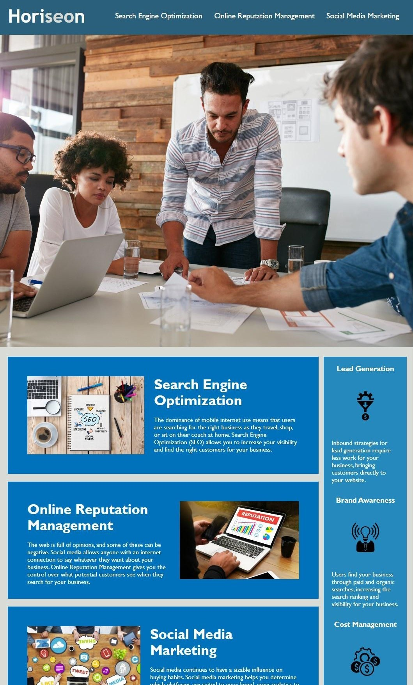

# marketing-agency-site-refactor
A refactoring of an outdated marketing agency website to meet accessibility standards.

## Changes made
- I renamed div containers to become semantic HTML Elements.
- I changed the CSS selectors and properties to match the new elemts they will be applied too.
- I added Alt attributes describing the images to increase the site accesibility. 

### Link to website
[View Webpage](https://mariop578.github.io/marketing-agency-site-refactor/)